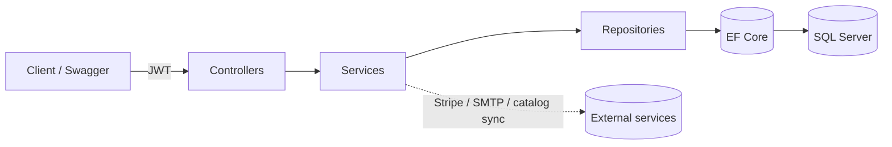

# EcommerceApp

A compact ASP.NET Core 6 e-commerce **Web API** that goes well beyond CRUD: it integrates
**Stripe Checkout** for payments, runs **Quartz** scheduled and on-demand **catalog sync** from
an external product source, generates **server-side PDF invoices** and emails them via SMTP, and
secures everything with **JWT auth plus custom authorization plumbing** (a model binder that
injects the authenticated user id into actions). The order workflow is modeled as a real
**domain state machine** (Submitted → Paid → Dispatched), not an anemic CRUD record.

## Tech stack

- **Runtime / framework:** .NET 6, ASP.NET Core Web API (controller-based)
- **Persistence:** Entity Framework Core 6 + SQL Server (code-first, migrations)
- **Auth:** JWT bearer (`Microsoft.AspNetCore.Authentication.JwtBearer`) + claim-based authorization
- **Payments:** Stripe (`Stripe.net`) — Checkout Sessions
- **Scheduling:** Quartz.NET (`Quartz.AspNetCore`)
- **Email:** MailKit / MimeKit (SMTP with PDF attachment)
- **PDF:** PdfSharpCore / PDFsharp
- **API docs:** Swashbuckle (Swagger / OpenAPI) with XML doc comments

## Features

- User **registration & login** with JWT issuance.
- **Product catalog**: browse (any authenticated user); update / delete / sync (admin only).
- **Orders**: create from product ids, Stripe checkout, payment confirmation, dispatch.
- **Invoices**: generated as PDF on payment, stored on the order, downloadable and re-sendable by email.
- **Scheduled catalog sync** (daily Quartz cron) plus an admin on-demand trigger.
- Uniform `APIResult<T>` response envelope across the API.

## Architecture at a glance

A layered N-tier monolith: HTTP → Controller → Service → Repository → EF Core → SQL Server.



Full reasoning (including why-not Clean/Hexagonal/DDD/vertical-slice) is in
[docs/ARCHITECTURE.md](docs/ARCHITECTURE.md); the schema is in
[docs/DATA-MODEL.md](docs/DATA-MODEL.md).

## Getting started

### Prerequisites

- [.NET 6 SDK](https://dotnet.microsoft.com/download)
- SQL Server (LocalDB, Express, or a full instance)
- EF Core CLI tools: `dotnet tool install --global dotnet-ef`
- A [Stripe](https://stripe.com) account (test keys) and an SMTP account if you want the
  payment and email flows to work end to end.

### Configure secrets

Application secrets are **not committed**. `appsettings.json` is git-ignored and an example file
with placeholders is provided:

1. Copy the example to a real config file:
   ```bash
   cp appsettings.Example.json appsettings.json
   ```
2. Fill in real values for the connection string, JWT key, Stripe keys, and SMTP credentials.
   Prefer [user-secrets](https://learn.microsoft.com/aspnet/core/security/app-secrets) for local
   development:
   ```bash
   dotnet user-secrets init
   dotnet user-secrets set "Stripe:SecretKey" "sk_test_..."
   ```

> Never commit real secrets. See [Security & secrets](#security--secrets).

### Run database migrations

```bash
dotnet ef database update --context EcommerceContext
```

### Launch

```bash
dotnet run
```

The API starts (per `Properties/launchSettings.json`) at **https://localhost:7063**
(and http://localhost:5063).

### Swagger

In the Development environment, interactive API docs are available at:

```
https://localhost:7063/swagger
```

Use the **Authorize** button to paste a `Bearer <token>` obtained from `POST /api/users/login`.

## API overview

All routes are under `api/[controller]`. Most actions return HTTP 200 with an `APIResult<T>`
envelope (`Status`, `Data`, `Error`) — including for expected failures; see the Swagger docs and
[docs/ARCHITECTURE.md](docs/ARCHITECTURE.md#genuinely-non-trivial-pieces-deliberate-choices) for
the rationale.

| Area | Endpoints |
|---|---|
| Users (anonymous) | `POST /register`, `POST /login` |
| Products | `GET /` (auth); `PUT /`, `DELETE /{id}`, `GET /sync` (admin) |
| Orders (auth) | `POST /`, `GET /`, `GET /user-based`, `GET /checkout`, `GET /checkout-confirm`, `PUT /dispatch`, `GET /invoice`, `POST /resend-email` |

## Design decisions

- [docs/ARCHITECTURE.md](docs/ARCHITECTURE.md) — layered N-tier rationale, the throw-vs-result
  boundary, the custom JWT model binder, the Order state machine, scheduling, payments, and an
  honest "what I'd harden for production" section.
- [docs/DATA-MODEL.md](docs/DATA-MODEL.md) — ER diagram, owned value object, GUID-string value
  conversions, many-to-many join table, and schema trade-offs.

## Security & secrets

Configuration files with real credentials are git-ignored (`appsettings.json`,
`appsettings.Development.json`). Use `appsettings.Example.json` as the template and keep real
values in user-secrets or your deployment's secret store. Tighten CORS (currently
`AllowAnyOrigin`) and review the production-hardening notes in the architecture doc before
deploying.
