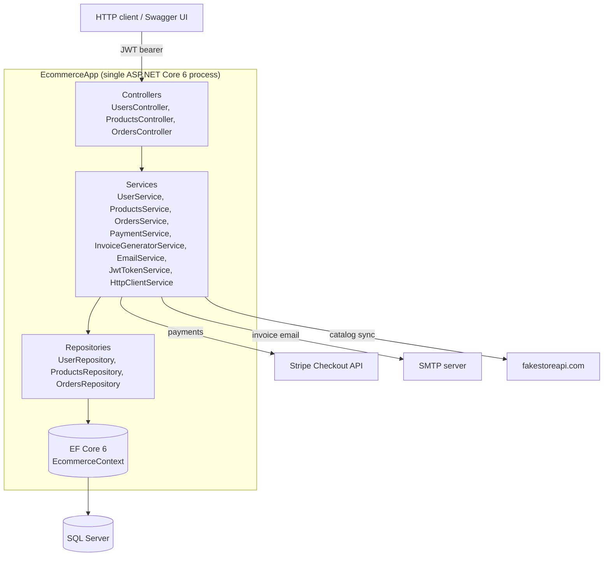

# Architecture

This document describes the architecture **as it actually exists in the code**, and the
reasoning behind the design choices. Every claim below is grounded in the source
(`Program.cs`, the `Controllers` / `Services` / `Repositories` / `Data` folders).

## Style: layered N-tier monolith

The application is a single ASP.NET Core 6 Web API process — a **monolith** — organized into
**horizontal layers** (it is *not* feature-sliced/vertical-slice; the folders are technical
layers, not features). A request flows strictly downward through the layers:

### Layer responsibilities

| Layer | Folder | Responsibility |
|---|---|---|
| **Controllers** | `Controllers/` | Thin HTTP adapters. Bind input, call exactly one service method, translate the internal result into the `APIResult<T>` envelope. No business logic. |
| **Services** | `Services/` | Business orchestration and rules: order lifecycle, payment/invoice/email coordination, catalog sync. Return `InternalDataTransfer<T>`. |
| **Repositories** | `Repositories/` | Encapsulate EF Core queries (`Add`, `Get*`, `Delete`). Return entities. |
| **Data** | `Data/` | `EcommerceContext` + `IEntityTypeConfiguration<T>` Fluent mappings. |

Dependencies point **inward/downward only** and are resolved through interfaces registered in
`Program.cs` (`AddScoped<IUserService, UserService>()`, etc.), so each layer depends on the
abstraction of the one below it.

### A known boundary nuance

`SaveChangesAsync()` is called in the **services**, not the repositories, and services inject
`EcommerceContext` directly alongside their repositories. So the repository abstraction is
deliberately thin: repositories stage changes on the change-tracker, and the service owns the
unit-of-work/transaction boundary for a request. This is a pragmatic simplification, not a full
Unit of Work pattern — see "Known limitations".

## Why these choices

### Why layered N-tier (and not something heavier)
For an API of this size — three aggregates (User, Product, Order), one database, one team — a
straightforward Controller → Service → Repository → EF layering gives the things that actually
matter here: a clear place for each kind of code, testable seams at the interfaces, and a
structure any .NET developer can navigate immediately. The ceremony of a more elaborate
architecture would not buy proportional value at this scope.

### Why not Clean Architecture
Clean/Onion architecture would add a domain-centric core with the database and framework pushed
to the outer rings behind ports. The benefits — framework independence, a pure domain that
doesn't reference EF — are real, but the cost is several extra projects/abstractions and mapping
layers. With a single SQL Server backing store and no realistic intent to swap the persistence
technology, that inversion would be ceremony without payoff. The project keeps EF types visible
to the services on purpose.

### Why not Hexagonal / Ports & Adapters
Hexagonal architecture shines when there are many interchangeable adapters around a domain (e.g.
several inbound transports, swappable outbound integrations) that you want to test in isolation
behind ports. Here the outbound integrations (Stripe, SMTP, the catalog HTTP source) are each
already wrapped behind a single service interface (`IPaymentService`, `IEmailService`,
`IHttpClientService`), which delivers the one practical benefit — a mockable seam — without
adopting the full ports-and-adapters structure and its directory overhead.

### Why not full DDD
The code intentionally borrows **tactical DDD** where it pays off and stops short of the
strategic machinery:
- `Order` is a genuine **rich domain model / state machine**: private setters, a factory
  constructor, and guarded transitions (`MarkPaid` → `StoreInvoice` → `MarkDispatched`) that
  enforce invariants instead of letting callers set `Status` freely.
- `RateValueObject` is a **value object**, persisted as an EF **owned type**.

It does **not** introduce aggregates with repositories per aggregate root, domain events, a
ubiquitous-language bounded-context split, or a separate domain project — there is one bounded
context (this app) and the model is small enough that those constructs would add indirection
without reducing real complexity.

### Why not vertical-slice / feature folders
The project is organized by **technical layer** (Controllers, Services, Repositories, Data),
not by feature. Vertical-slice would group everything for "place order" or "sync catalog" into a
self-contained slice. That trades cross-cutting consistency (every service looks the same, every
controller maps results the same way) for per-feature cohesion. At three resources the
horizontal layering keeps the patterns uniform and the learning curve flat; the project is
explicitly **not** feature-sliced.

## Genuinely non-trivial pieces (deliberate choices)

These are the parts that go beyond CRUD plumbing and are worth calling out:

- **Custom JWT user-id model binder + Swagger hiding.**
  `FromJwtUserIdAttribute` / `JwtUserIdBinder` (`Filters/`) bind the `userid` claim straight into
  action parameters (`[FromJwtUserId] string userId`), so controllers never read the
  `ClaimsPrincipal` manually and a client cannot spoof the id via the request body. The companion
  `HideJwtUserIdParameterFilter` removes that synthetic parameter from the generated OpenAPI doc
  so it doesn't show up as a required input in Swagger UI.

- **The `APIResult<T>` result/error envelope and the throw-vs-result boundary.**
  Services return `InternalDataTransfer<T>` (a result object carrying `Status`, `Data`, and a
  structured `Error`) rather than throwing for *expected* domain failures (not found, invalid
  state, email already exists). Controllers map that to `APIResult<T>`. The design distinguishes
  **expected domain outcomes** (modeled as result values, returned as HTTP 200 with
  `Status = false`) from **unexpected faults** (genuine exceptions, which propagate — see
  limitations). This keeps control flow explicit and the happy/sad paths symmetric.

- **`Order` state machine.** See above — the order lifecycle is enforced inside the entity.

- **Quartz scheduled + on-demand catalog sync.**
  `SyncProductsJob` pulls the catalog from `fakestoreapi.com` and replaces the `Products` table
  inside a transaction. It runs on a daily Quartz cron (`0 0 12 * * ?`, wired in `Program.cs`)
  and can also be triggered on demand by admins via `GET /api/products/sync`, which fires the
  same job through `ISchedulerFactory`.

- **Stripe Checkout flow.** `PaymentService.CreateSession` builds a Stripe Checkout session from
  the order's line items and returns the hosted payment URL; the success URL points back at
  `checkout-confirm`, which marks the order paid, generates the invoice, and emails it.

- **Server-side PDF invoice + email.** `InvoiceGeneratorService` renders a PDF with PdfSharpCore
  and returns it base64-encoded; `EmailService` (MailKit/MimeKit) sends it as an attachment. The
  base64 invoice is also stored on the order so it can be re-downloaded or re-sent.

## Known limitations / what I'd harden for production

This section is deliberately honest — these are real gaps, not a feature list.

- **No automated tests.** There is no test project. The interface-based DI makes the services and
  controllers straightforward to unit-test with mocked repositories; that's the first thing I'd
  add.
- **No centralized exception-handling middleware.** Expected failures use the result envelope, but
  an unexpected exception (including the path where `GetErrorTypeByDescription` rethrows for
  exception-type errors) surfaces as an unhandled 500. A global exception middleware mapping to a
  consistent error envelope would close that gap.
- **Missing indexes on queried columns.** `Order.UserUid` and `User.Email` are queried but not
  indexed (see `docs/DATA-MODEL.md`).
- **Password handling.** Credentials are stored using a reversible AES helper with a hardcoded
  key and a fixed IV (`Utils/EncryptionHandler.cs`). Passwords should be **one-way hashed** with a
  salted, slow algorithm (e.g. ASP.NET Core `PasswordHasher`, bcrypt, or Argon2) rather than
  encrypted. (Email is encrypted deterministically to allow lookup, which is a separate
  trade-off.)
- **Payment confirmation trusts the redirect.** `checkout-confirm` marks an order paid based on
  the Stripe success redirect rather than a verified Stripe **webhook** with signature
  validation. A webhook-driven confirmation would be the production-correct approach.
- **Config & CORS.** Secrets currently live in `appsettings.json` (to be moved to user-secrets /
  a vault and rotated — see README), and CORS is configured `AllowAnyOrigin` which should be
  tightened to known origins.
- **Order authorization breadth.** `GET /api/orders` returns all orders to any authenticated
  user; the admin-claim guard for it is present in source but commented out.

See also: [DATA-MODEL.md](./DATA-MODEL.md) for the schema and persistence decisions.
