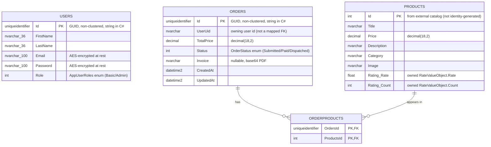

# Data Model

This document describes the database schema **as it actually exists in the code** —
the EF Core entities (`Models/Database`), their Fluent configurations
(`Data/Configurations`), and the `InitialCreate` migration. The provider is
**SQL Server**, and the schema is **code-first** (EF Core 6).

## ER diagram



> Note: `ORDERPRODUCTS` is the **implicit many-to-many join table** EF generates for the
> `Order.Products` / `Product.Orders` navigation pair. It is not a C# entity; it is created
> by `OrderConfiguration` via `.UsingEntity(j => j.ToTable("OrderProducts"))`.

## Tables (from `InitialCreate`)

| Table | Key | Notes |
|---|---|---|
| `Users` | `Id` (non-clustered PK) | `Id` is a GUID stored as `uniqueidentifier`; `FirstName`/`LastName` ≤ 36 chars; `Email`/`Password` ≤ 100 chars (AES ciphertext); `Role` is an int enum. |
| `Products` | `Id` (clustered PK) | `Id` comes from the external catalog (fakestoreapi), **not** database-generated. Owns `Rating_Rate` (float) and `Rating_Count` (int). |
| `Orders` | `Id` (non-clustered PK) | `Id` is a GUID; `Status` is an int enum; `Invoice` nullable. |
| `OrderProducts` | composite (`OrdersId`,`ProductsId`) | Join table; both FKs `ON DELETE CASCADE`; secondary index `IX_OrderProducts_ProductsId`. |

## Modeling decisions

### Many-to-many via a named join table
An order contains many products and a product can appear in many orders, so the natural
relationship is many-to-many. EF Core 6 supports skip navigations
(`Order.Products` ⇄ `Product.Orders`) and generates the join table automatically. The code
names it explicitly (`OrderProducts`) rather than accepting EF's default
(`OrderProduct`) for readability and migration stability. No payload (e.g. quantity) is stored
on the join row — the current model treats each product line as quantity 1.

### Owned type for the product rating
`RateValueObject` (`Rate`, `Count`) has no identity of its own — it only has meaning as part of
a product. Modeling it as an **owned type** (`OwnsOne`) keeps it as a value object in the domain
while persisting its fields as columns (`Rating_Rate`, `Rating_Count`) on the `Products` table,
avoiding a needless separate table and join.

### GUID-string keys + value conversion
`User.Id` and `Order.Id` are `string` in C# (convenient for serialization and for passing ids
around as the `userid` JWT claim and order `identifier` query parameter) but are stored as SQL
`uniqueidentifier`. The Fluent config bridges the two with
`HasConversion(s => new Guid(s), g => g.ToString("D"))`. The PKs are declared **non-clustered**
(`IsClustered(false)`) so random GUIDs don't cause clustered-index fragmentation on insert.

### Order as a rich entity
`Order` is not an anemic record: it has a private parameterless constructor for EF, a public
factory constructor, private setters, and guarded state-transition methods
(`MarkPaid` → `StoreInvoice` → `MarkDispatched`). The persisted `Status`/`Invoice` columns back
that state machine. `ProductUids` is `[NotMapped]` — a transient input list distinct from the
mapped `Products` navigation.

## Correctness fix applied in this pass

`ProductConfiguration` previously configured the owned rating incorrectly:

```csharp
// before — Count mapped twice (as decimal), Rate never explicitly mapped
cci.Property(c => c.Count).IsRequired().HasColumnType("decimal");
cci.Property(c => c.Count).IsRequired();
```

This produced a `Rating_Count` column typed `decimal` even though `Count` is an `int`, and never
configured `Rate`. It is now:

```csharp
rating.Property(r => r.Rate).IsRequired();
rating.Property(r => r.Count).IsRequired();
```

`Rating_Count` should therefore be `int`, not `decimal`. **A follow-up EF migration is required**
to alter the existing column type in any database already created from `InitialCreate`
(`dotnet ef migrations add FixRatingCountType`). No migration was generated in this pass to keep
the change reviewable and to avoid guessing at the target environment.

## Trade-offs / future work

- **Missing indexes on queried columns.** `Orders` is queried by `UserUid`
  (`GetOrderByUserId`) and `Users` by `Email` (login/registration lookup), but neither column is
  indexed. Both are good candidates for a non-clustered index (and `User.Email` for a unique
  index, since registration treats it as unique).
- **`UserUid` is a loose reference, not a mapped FK.** `Order.UserUid` holds the owning user's id
  but there is no foreign-key relationship to `Users` in the model, so referential integrity for
  order ownership is enforced only in application code.
- **Catalog sync is delete-all-then-reinsert.** `SyncProductsJob` calls
  `RemoveRange(_context.Products)` then bulk-inserts the fresh catalog inside a transaction.
  Because `OrderProducts` has cascading FKs to `Products`, deleting products that are referenced
  by historical orders would cascade-delete those join rows (losing order line history). An upsert
  / merge by product id would be safer than truncate-and-replace.
- **Product ids are externally assigned.** Ids come from the external source rather than being
  database-generated, so the catalog's integrity depends on that source keeping ids stable.
